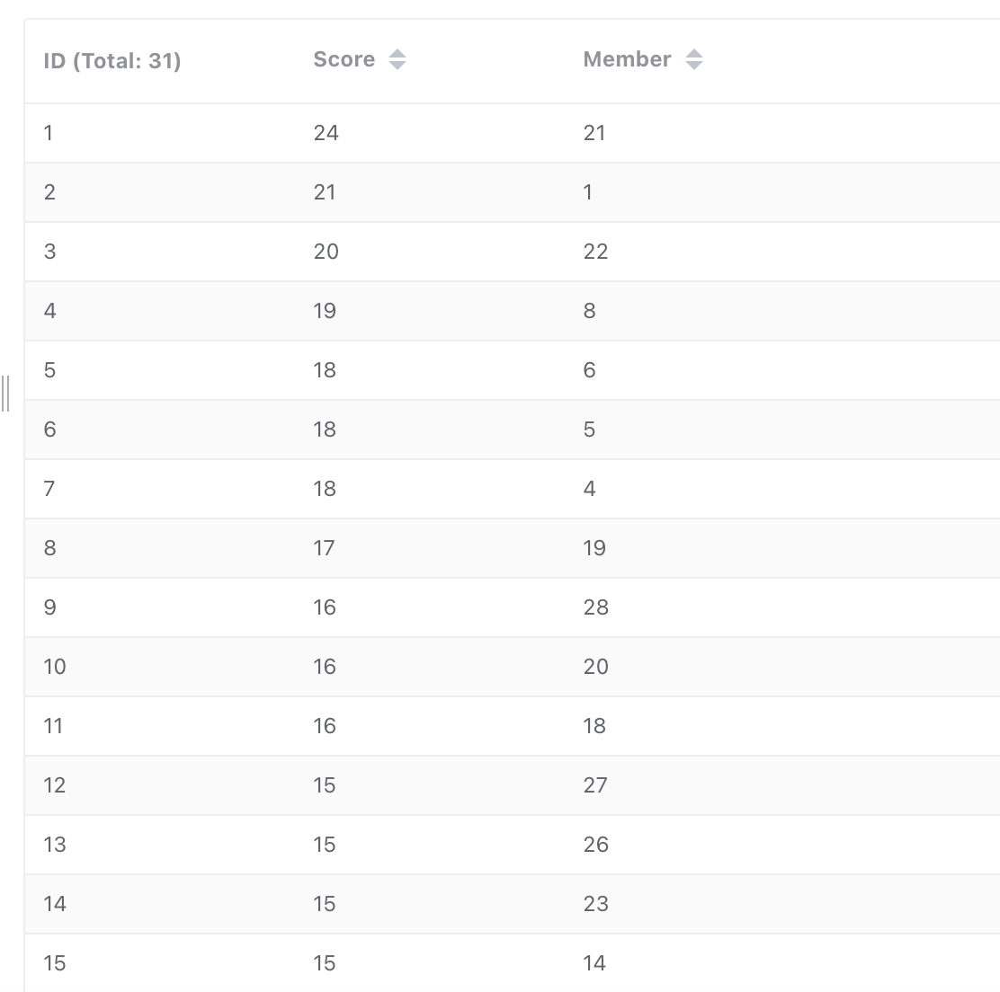

# Java后端开发学习笔记：使用Redis实现一个简单的排行榜

## 前言

相较于网络上绝大多数的文章，只给出了最基本的实现方案，而没有过多对实际业务进行探讨，本篇文章将考虑高并发情况下读写一致性问题，实现多种排行榜。

排行榜类型：

*   最近一小时排行榜
*   最近一天的排行榜

排行榜的score：

*   综合排序=点击+评论+点赞数
*   点击量
*   评论数
*   点赞量

本文目标为实现一个较为完整的项目，并使用**测试工具**验证所实现的方案的正确性，可以实现高并发条件下的数据库读写一致性，Redis缓存和MySQL数据库的一致性。此外，本文还探讨了一些主要的优化方案，以提高缓存命中率和减少磁盘IO。

这篇文章的总体内容包括

- 新建一个SpringBoot项目，并定义数据库表，作为排行榜的实体内容
- 思考和设计上述排行榜的解决方案
- 项目优化

项目地址：

## 准备

我使用的是较新的SpringBoot版本，以下是项目主要包含的组件：

- SpringBoot: 3.x
- MySQL: 8.x (docker容器)
- Mybatis Plus: 3.5.x
- Redis: 7.x (docker容器）

这里我使用书籍作为排行榜的主题，字段设计比较简单，主要为了实现我们的场景。
首先设计**书Book**的表结构

| 字段         | 类型        | 注释         |
| ------------ | ----------- | ------------ |
| id           | bigint      | 主键         |
| name         | varchar(30) | 书名         |
| authorId     | bigint      | 作者id，外键 |
| public\_date | datetime    | 出版时间     |
| click\_num   | int         | 点击量       |
| like\_num    | int         | 点赞量       |
| comment\_num | int         | 评论数       |
| create_num   | datetime    | 创建时间     |
| update_num   | datetime    | 更新时间     |

```sql
CREATE TABLE `book` (
                        `id` bigint unsigned NOT NULL AUTO_INCREMENT,
                        `name` varchar(30) NOT NULL COMMENT '书名',
                        `author_id` bigint unsigned NOT NULL COMMENT '书的作者id',
                        `click_num` int unsigned NOT NULL COMMENT '点击量',
                        `like_num` int unsigned NOT NULL COMMENT '点赞数',
                        `comment_num` int unsigned NOT NULL COMMENT '评论数',
                        `create_time` datetime DEFAULT NULL COMMENT '创建时间',
                        `update_time` datetime DEFAULT NULL COMMENT '更新时间',
                        PRIMARY KEY (`id`)
) ENGINE=InnoDB DEFAULT CHARSET=utf8mb4 COLLATE=utf8mb4_0900_ai_ci COMMENT='书籍';
```

配置`Redis`缓存，将`RedisTemplate<String, Object>`注册给IoC容器，然后在`Service`中可以使用`Autowired`注解即可使用：

```java
// config/CacheConfig.java
@Configuration
public class CacheConfig {

    /**
     * Redis Cache Configuration
     */
    @Bean
    public RedisTemplate<String, Object> redisTemplate(RedisConnectionFactory redisConnectionFactory) {
        RedisTemplate<String, Object> redisTemplate = new RedisTemplate<String, Object>();

        redisTemplate.setConnectionFactory(redisConnectionFactory);
        // 设置键和值的序列化
        redisTemplate.setKeySerializer(new StringRedisSerializer());
        redisTemplate.setValueSerializer(new Jackson2JsonRedisSerializer<Object>(Object.class));
        return redisTemplate;
    }
}
```

统一返回信息包装和全局异常处理不做展示，可见GitHub仓库代码。

在这里我们设置四个API接口供前端调用，即**增删改查**，另外还有一个方法是获取排行榜信息，先简单实现

---

新增书籍

```java
@Override
public R<Void> addBook(Book book) {
  boolean inserted = this.save(book);
  if (inserted) {
    return R.ok();
  } else {
    throw new GlobalException("书籍插入失败");
  }
}
```

删除书籍

```java
@Override
public R<Void> deleteBook(Long bookId) {
  // 删除数据库
  boolean b = this.removeById(bookId);
  if (b) {
    return R.ok();
  } else {
    throw new GlobalException("用户不存在，删除操作");
  }
}
```

更改书籍信息

```java
@Override
public R<Void> updateBook(Book book) {
	Book b = this.getById(book.getId());
	if (b == null) {
		throw new GlobalException("用户不存在");
	}
	b.setName(book.getName());
	b.setAuthorId(book.getAuthorId());
	b.setUpdateTime(LocalDateTime.now());
	this.save(b);
	return R.ok();
}
```

查询书籍信息

```java
@Override
public R<Book> getBook(Long bookId) {
  // 读数据库操作
  Book book = this.getById(bookId);
  if (book == null) {
    throw new GlobalException("Book not found: "+bookId);
  } else {
    return R.ok(book);
  }
}
```

## 方案探索

对于`Redis`的`zset`数据结构，包含三个参数：

| 参数   | 类型            | 意义                     |
| ------ | --------------- | ------------------------ |
| key    | String (Object) | 键，用来标识唯一的zset   |
| member | String (Object) | 值，我们要存储的数据信息 |
| score  | Double          | 分数，用来进行排序的权值 |

可以使用`Redis`可视化工具进行查看：




我们要实现书籍的总排行榜（或者说累计排行榜），我们可以设置`key`为`book:sort`，然后插入书籍的数据，选择`member`为书籍的唯一标识符即主键`id`，`score`设置为点击量、评论数或点赞量，因为我们要实现单独的排序，直觉就是维护多个`zset`。

思考到这里，我们就可以实现一个最简单的排行榜了，用户请求点击、评论、点赞，都会调用服务器的相关接口，那么在这些接口中维护这些排行榜`zse`t。

### 总排行榜

定义全局排行榜的key

```java
public class RedisConstant {
    /**
     * 总排行榜
     */
    public static String SORT_KEY = "book:sort";
    public static String getSortKey() {
        return SORT_KEY;
    }
}
```

查询书籍信息

```java
// service/impl/BookServiceImpl.java
@Override
public R<Book> getBook(Long bookId) {
	// 读数据库操作
	Book book = this.getById(bookId);
	if (book == null) {
		throw new GlobalException("Book not found: "+bookId);
	} else {
		String sortKey = RedisConstant.getSortKey();
		BoundZSetOperations<String, Object> zSetOperations = redisTemplate.boundZSetOps(sortKey);
    // 如果bookId不存在，默认从0开始，这里就是新增操作
    // 如果bookId已存在，+1
		zSetOperations.incrementScore(bookId, 1.0);
		return R.ok(book);
	}
}
```

查询排行榜信息

```java
@Override
public R<List<Book>> rankBook(int start, int end) {
  String sortKey = RedisConstant.getSortKey();
  BoundZSetOperations<String, Object> zSetOperations = redisTemplate.boundZSetOps(sortKey);
  Set<Object> objects = zSetOperations.reverseRange(start, end);
  if (objects == null) {
  	throw new GlobalException("查询排行榜失败");
  }
  List<Book> books = new ArrayList<Book>(objects.size());
  objects.forEach( o -> books.add(bookMapper.selectById(Long.valueOf(o.toString()))));
  return R.ok(books);
}
```

这样就算实现了一个最基本的全局排行榜，`key`是一个固定值，从程序启动开始，一直到一年后，点击量一直累积。这种排行榜不是很常见，典型的例子有游戏赛季排行榜、NBA球星总得分榜。

那如何实现某一个时间段内的排行榜呢？

### 时间区间

实现的基本思想是：**把时间戳的信息添加到zset的key中。**

以小时时间间隔为例，定义`zset`的键：

```java
public static String SORT_HOUR_PREFIX = "book:hour:";
public static String getSortHourKey() {
  // 时间精确到当前的时
	return SORT_HOUR_PREFIX + LocalDateTime.now().format(DateTimeFormatter.ofPattern("yyyyMMddHH"));
}
```

这样，在进行zset操作的时候，每个小时的数据都会集中在同一个zset中，例如

```java
// 2023-06-23 17:00:00至17:59:59
sortKey = 2023060317
// 2023-06-23 22:00:00至22:59:59
sortKey = 2023060322
```

更新我们的`getBook`方法

```java
@Override
public R<Book> getBook(Long bookId) {
  // 读数据库操作
  Book book = this.getById(bookId);
  if (book == null) {
  	throw new GlobalException("Book not found: "+bookId);
  } else {
    // 总的排行榜
    String sortKey = RedisConstant.getSortKey();
    BoundZSetOperations<String, Object> zSetSort = redisTemplate.boundZSetOps(sortKey);
    zSetSort.incrementScore(bookId, 1.0);

    // 当前小时内的排行榜
    String hourSortKey = RedisConstant.getSortHourKey();
    BoundZSetOperations<String, Object> zSetHour = redisTemplate.boundZSetOps(hourSortKey);
    zSetHour.incrementScore(bookId, 1.0);
    return R.ok(book);
  }
}
```

那如何维护一天的排行榜呢，我觉得最简单的方法就是使用一个`daySortKey`包含精确到日的时间戳。

```java
public static String SORT_DAY_PREFIX = "book:day:";
public static String getSortDayKey() {
	return SORT_DAY_PREFIX + LocalDateTime.now().format(DateTimeFormatter.ofPattern("yyyyMMdd"));
}
```

更新`getBook`方法

```java
@Override
public R<Book> getBook(Long bookId) {
  // 读数据库操作
  Book book = this.getById(bookId);
  if (book == null) {
  	throw new GlobalException("Book not found: "+bookId);
  } else {
    // 总的排行榜
    String sortKey = RedisConstant.getSortKey();
    BoundZSetOperations<String, Object> zSetSort = redisTemplate.boundZSetOps(sortKey);
    zSetSort.incrementScore(bookId, 1L);

    // 当前小时内的排行榜
    String hourSortKey = RedisConstant.getSortHourKey();
    BoundZSetOperations<String, Object> zSetHour = redisTemplate.boundZSetOps(hourSortKey);
    zSetHour.incrementScore(bookId, 1L);

    // 当天的排行榜
    String daySortKey = RedisConstant.getSortDayKey();
    BoundZSetOperations<String, Object> zSetDay = redisTemplate.boundZSetOps(daySortKey);
    zSetDay.incrementScore(bookId, 1L);

    return R.ok(book);
	}
}
```

网络上有其他人提出的一些方法，可以使用`zset`的并集操作，比如最近三小时的`zset`可以求并集，获得一个最近三小时的`zset`。同理，如果最近24小时的`zset`求并集获得最近一天的热榜`zset`，当然我觉得这样做好像也不是非常必要，甚至可能更复杂了，并且在`Redis`最佳实践中避免直接使用多个集合求并集或者交集的情况。

```java
ZUNIONSTORE destination numkeys key [key ...] [WEIGHTS weight [weight ...]] [AGGREGATE SUM|MIN|MAX]
```

如果将时间戳信息添加到`zset`的`key`中，那么肯定会维护特别多的`zset`。

在`Redis`中的查找是非常迅速的，我们并不需要将某个时刻的点击量始终与数据库中书籍的点击量同步，只需要保证最终一致性即可。试想一下，我们在看b站或者抖音的时候，点赞数和评论数在自己的视角里应该是相对静态的。因此我们可以对`Redis`中过期的`zset`进行手动清除，释放`Redis`内存空间。

在`Spring`中，我们可以使用**定时任务**来完成上述功能，比如在20:00:01的时候，执行一个定时任务，将19时`zset`数据写到数据库`MySQL`中，然后在`Redis`中删除这个`zset`。根据业务场景，只需要更新某本书的点击量、访问量、评论量的总数即可，即定期更新`key`为`book:sort`中的`zset`到数据库。总之，我选择Spring Task进行以下功能：

1. 删除已经过期的`key`为`book:hour:x`的`zset`，其中当前时刻为`y`，满足`x<y`
2. 删除已经过期的`key`为`book:day:x`的`zset`，其中当前时刻为`y`，满足`x<y`
3. 将`key`为`book:sort`中的数据同步到MySQL等关系型数据库中

注：在`Redis`中可以对`zset`设置过期时间，这样的话可以避免手动对`zset`进行清理，需要在第一次使用该`zset`的时候设置过期时间。

```java
/**
 * 每天的02:01:10执行该定时任务
*/
@Override
@Scheduled(cron = "10 1 2 * * ? *")
@Transactional
public void updateDatabase() {
  log.info("持久化Redis数据到MySQL中");
  String sortKey = RedisConstant.getSortKey();
  Set<ZSetOperations.TypedTuple<Object>> tuples = redisTemplate.opsForZSet().rangeWithScores(sortKey, 0, -1);
  if (tuples == null) {
    return;
  }

  List<Book> books = tuples
    .stream()
    .filter(tuple -> tuple.getValue() != null)
    .map(objectTypedTuple -> {
      Book book = new Book();
      book.setId(Long.valueOf(Objects.requireNonNull(objectTypedTuple.getValue()).toString()));
      book.setClickNum(Objects.requireNonNull(objectTypedTuple.getScore()).intValue());
      return book;
    }).toList();
  // FIXME: 这里的更新机制是什么，我们期望的：根据id更新点击量
  this.updateBatchById(books);

  String lastSortDayKey = RedisConstant.getLastSortDayKey();
  Boolean deleted = redisTemplate.delete(lastSortDayKey);
  if (Boolean.TRUE.equals(deleted)) {
    log.info("清除前一天的排行榜成功");
  } else {
    log.info("清除前一天的排行榜失败");
  }

  for(int i=1; i<=24; i++) {
    String sortHourKey = RedisConstant.SORT_HOUR_PREFIX + LocalDateTime.now().minusHours(i).format(DateTimeFormatter.ofPattern("yyyyMMddHH"));
    Boolean deletedSortHourKey = redisTemplate.delete(sortHourKey);
    if (Boolean.FALSE.equals(deletedSortHourKey)) {
      log.info("清除"+sortHourKey+"失败");
    }
  }
}
```

如果把时间维度也考虑到`score`中，该如何设计？这个问题很多博客都有讨论，因为`score`相同的情况下，如何进行第二个维度排序[利用Redis Zset实现双维度排行榜](https://segmentfault.com/a/1190000043096387)。

### 时间衰减

考虑到这里，仍然有一些缺陷。我们如果以**小时**为时间单位来配置`zset`，那么会出现**不连续**的现象。客观上时间是连续的，05:28至05:50这段时间和05:50至06:12这段时间应该是具有**相同的地位**，不知道这个解释是否清晰。假如在05:50至06:12这段时间有一个点击量激增，但是被分割在5和6两个`zset`（点击量的`score`被分在了两个篮子里面），而05:28至05:50这段时间的点击量产生的`score`是在一个`zset`中。

假如在某天的`23:58:00`娱乐圈爆了一个大瓜，在短短的一分钟内点击量出现暴增，直接顶到了排行榜第一，比如事件a在`23:58:00`到`23:59:30`点击量为10000，之后点击量稍稍下降，而另一个事件b在这段时间内不是热点，但是在`00:00:00`之后，点击量稍微上涨一点。因为第二天，我们的`sortDayKey`已经更新，所有的点击量清零，事件a在短时间内点击量少于事件b，于是瞬间直接从一个热榜头条转变为排行榜上看不到名字。

不知道我的描述是否清晰，我想表达的意思是，如果以某个时间间隔，激进的更新zset，可能会出现**时间不连续**的情况。以分作为排行榜的时间单位，`08:00:00`->`08:01:00`->`08:02:00`被人为切成了两个互不相连的区间，而事实上`08:00:55`至`08:01:05`这段时间是连续的，人为划分时间区间是不合理的。如何实现时间连续的排行榜呢？
🌟：只维护一个zset，所有的score是累计值，相当于总的排行榜，网上可以找到很多类似的API文章。
🌟🌟：排行榜的key中包含时间信息，可以维护某个时间段内的排行榜

🌟🌟：将时间拼接到`score`中，可以实现双维度排行。
🌟🌟🌟：时间连续的排行榜，下面将详细叙述。
解决方案：**根据时间设置score的衰减函数**
$$
score = \left\{\begin{array}{lr}
(1-\frac{currentTime-lastTime}{timeDuration})*score + 1,  currentTime-lastTime < timeDuration\\
1
\end{array}\right. \\
$$

其中`score`表示`zset`中的分数，$lastTime$为上一次更新的时间，$currentTime$为当前时间，$\frac{currentTime-lastTime}{timeDuration} \in [0, 1]$，这样$score$会随着时间进行衰减，当时间间隔达到或超过$timeDuration$时，`score`会衰减为0。这里只是一个抛砖引玉，实际上可以设计更加复杂的衰减函数。在计算机网络中，$SRTT$的计算就是类似的一个衰减函数：
$$
SRTT = \alpha * SRTT  + ((1-\alpha) * RTT
$$
其实很多地方都有应用，包括强化学习里面。

再回到我们的排行榜问题，将这一思想落实到实际开发过程中，发现了一些困难。比如，我们使用衰减函数更新某个`key`的`score`，但是其他没有被查询的`key`，`score`是不会被更新的，这样就会造成了`score`不准确的情况，因为`key`之间比较产生了不一致的问题。分析原因，是需要将过去时间的全部`key`进行更新。举个例子再来详细说明这个问题：

`zset` 中的数据包括：

| member | score | 上次更新时刻 |
| ------ | ----- | ------------ |
| 1      | 10    | 1            |
| 2      | 10    | 2            |
| 3      | 10    | 3            |
| 4      | 10    | 4            |
| 5      | 10    | 5            |

上表中，`score`的分数都为10，但是上次更新的时间即执行`getBook`的时刻不一致，如果按照分数衰减的方案，排行信息是`5>4>3>2>1`。这里的更新`score`类似于`Redis`中的惰性删除策略，只有在查询键的时候去更新该`score`。

同样使用`score`衰减的方式，可以逆向操作，过去的$score$不变，而将最近的访问，获取更高的`score`即可，同样达到了过去得分衰减的效果，使用数学表达为：
$$
score = score + (currTime-bencnTime)*\beta
$$
$benchTime$的值可以根据具体的业务而确定，后面我将实现一个具体的时间衰减排行榜$demo$。这样就可以实现时间连续的排行榜，无论是小时榜还是周榜月榜都可以动态更新。

这里我们需要详细讨论实现策略，因为`score`是有范围的，至少不能实现分数溢出吧（这个并不容易，因为`double`的范围非常大）！

以天为单位制定连续排行榜，一天有86400秒，选定$benchTime=02:01:10$，在凌晨进行刷新排行榜是个不错的选择。简单地取$\beta=1.1$，那么最低的分数为$1$，最高的分数为$86399*1.1=95039$，平均数为$47520$，假设每秒的点击量为$t$，那么总分数为
$$
score_{avg} = 47520 \cdot 86400 \cdot t \\
= 4105728000 \cdot t
$$
`double`的最大值的数量级是308，显然无论点击量有多大，都不会越界，留出一些位用来做时间排序也是足够的。

```java
public static String SMOOTH_SORT_KEY = "book:smooth";
public static String getSmoothSortKey() {
  // 获取当前日期，每天的02:01:00作为benchTime
  return SMOOTH_SORT_KEY + getSmoothSortDateTime().format(DateTimeFormatter.ofPattern("yyyyMMddHHmmss"));
}
// 删除zset时使用
public static String getLastSmoothSortKey() {
  return SMOOTH_SORT_KEY + getSmoothSortDateTime(1L).format(DateTimeFormatter.ofPattern("yyyyMMddHHmmss"));
}

private static LocalDateTime getLocalDateTime(LocalDateTime now) {
  LocalTime time = LocalTime.of(2, 1, 0);
  if (now.toLocalTime().isAfter(time)) {
    return LocalDateTime.of(now.getYear(), now.getMonth(), now.getDayOfMonth(), 2, 1, 0);
  } else {
    LocalDateTime lastDayTime = now.minusDays(1L);
    return LocalDateTime.of(lastDayTime.getYear(), lastDayTime.getMonth(), lastDayTime.getDayOfMonth(), 2, 1, 0);
  }
}

public static LocalDateTime getSmoothSortDateTime(long minusDays) {
  LocalDateTime now = LocalDateTime.now().minusDays(minusDays);
  return getLocalDateTime(now);
}

public static LocalDateTime getSmoothSortDateTime() {
  LocalDateTime now = LocalDateTime.now();
  return getLocalDateTime(now);
}
```

在查询书籍、删除书籍以及定时任务中均需要对`zset`进行操作，具体内容见代码：

1. 查询（点击）书籍

```java
@Override
public R<Book> getBook(Long bookId) {
  // 读数据库操作
  Book book = this.getById(bookId);
  if (book == null) {
    throw new GlobalException("Book not found: "+bookId);
  } else {
    // 总的排行榜
    String sortKey = RedisConstant.getSortKey();
    BoundZSetOperations<String, Object> zSetSort = redisTemplate.boundZSetOps(sortKey);
    zSetSort.incrementScore(bookId, 1.0);

    // 当前小时内的排行榜
    String hourSortKey = RedisConstant.getSortHourKey();
    BoundZSetOperations<String, Object> zSetHour = redisTemplate.boundZSetOps(hourSortKey);
    zSetHour.incrementScore(bookId, 1.0);

    // 当天的排行榜
    String daySortKey = RedisConstant.getSortDayKey();
    BoundZSetOperations<String, Object> zSetDay = redisTemplate.boundZSetOps(daySortKey);
    zSetDay.incrementScore(bookId, 1.0);

    // Smooth排行榜
    String smoothSortKey = RedisConstant.getSmoothSortKey();
    BoundZSetOperations<String, Object> zSetSmooth = redisTemplate.boundZSetOps(smoothSortKey);
    Duration duration = Duration.between(RedisConstant.getSmoothSortDateTime(), LocalDateTime.now());
    zSetSmooth.incrementScore(bookId, duration.getSeconds() * RedisConstant.BETA);

    return R.ok(book);
  }
}
```

2. 分页查询书籍

```java
@Override
public R<Page<Book>> getBookPage(int page, int pageSize) {
  Page<Book> bookInfo = new Page<>(page, pageSize);
  LambdaQueryWrapper<Book> queryWrapper = new LambdaQueryWrapper<>();
  queryWrapper.orderByDesc(Book::getUpdateTime);
  this.page(bookInfo, queryWrapper);
  return R.ok(bookInfo);
}
```

3. 获取各排行榜

```java
/**
     * 获取排行榜
     * @param start 开始索引
     * @param end 结束索引
     * @return 排行榜清单
     */
@Override
public R<List<Book>> rankDayBook(int start, int end) {
  return rank(start, end, RedisConstant.getSortDayKey());
}

@Override
public R<List<Book>> rankHourBook(Integer start, Integer end) {
  return rank(start, end, RedisConstant.getSortHourKey());
}

@Override
public R<List<Book>> rankBook(Integer start, Integer end) {
  return rank(start, end, RedisConstant.getSortKey());
}

@Override
public R<List<Book>> rankSmoothBook(Integer start, Integer end) {
  return rank(start, end, RedisConstant.getSmoothSortKey());
}


private R<List<Book>> rank(Integer start, Integer end, String sortKey) {
  BoundZSetOperations<String, Object> operations = redisTemplate.boundZSetOps(sortKey);

  Set<Object> rankObjects = operations.reverseRange(start, end);
  if (rankObjects == null) {
    throw new GlobalException("查询排行榜失败");
  }
  List<Book> books = rankObjects
    .stream()
    .map(o -> this.getById(Long.valueOf(o.toString())))
    .toList();
  return R.ok(books);
}
```

4. 上架新书

```java
@Override
public R<Void> addBook(BookAddDto bookAddDto) {
  Book book = new Book(bookAddDto.getAuthorId(), bookAddDto.getName());
  boolean inserted = this.save(book);
  if (inserted) {
    return R.ok();
  } else {
    throw new GlobalException("书籍插入失败");
  }
}
```

5. 下架书籍

```java
@Override
public R<Void> deleteBook(Long bookId) {
  String daySortKey = RedisConstant.getSortDayKey();
  String hourSortKey = RedisConstant.getSortHourKey();
  String sortKey = RedisConstant.getSortKey();
  String smoothSortKey = RedisConstant.getSmoothSortKey();

  // 删除redis缓存
  redisTemplate.opsForZSet().remove(daySortKey, bookId);
  redisTemplate.opsForZSet().remove(hourSortKey, bookId);
  redisTemplate.opsForZSet().remove(sortKey, bookId);
  redisTemplate.opsForZSet().remove(smoothSortKey, bookId);

  // 删除数据库
  boolean b = this.removeById(bookId);
  if (b) {
    return R.ok();
  } else {
    throw new GlobalException("用户不存在，删除操作失败");
  }
}
```

6. 更新书籍

```java
@Override
public R<Void> updateBook(BookUpdateDto bookUpdateDto) {

  Book b = this.getById(bookUpdateDto.getId());
  if (b == null) {
    throw new GlobalException("用户不存在");
  }
  b.setName(bookUpdateDto.getName());
  b.setAuthorId(bookUpdateDto.getAuthorId());
  this.updateById(b);
  return R.ok();
}
```

7. 定时任务，清除历史排行榜书籍

```java
/**
 * 每天的02:01:10执行该定时任务
 * 1. 持久化Redis中的点击量到数据库中
 * 2. 清除3种无效的ZSet
 */
@Override
@Scheduled(cron = "10 1 2 * * ? *")
@Transactional
public void updateDatabase() {
  log.info("持久化Redis数据到MySQL中");
  String sortKey = RedisConstant.getSortKey();
  Set<ZSetOperations.TypedTuple<Object>> tuples = redisTemplate.opsForZSet().rangeWithScores(sortKey, 0, -1);
  if (tuples == null) {
    return;
  }

  List<Book> books = tuples
    .stream()
    .filter(tuple -> tuple.getValue() != null)
    .map(objectTypedTuple -> {
      Long id = Long.valueOf(Objects.requireNonNull(objectTypedTuple.getValue()).toString());
      int clickNum = Objects.requireNonNull(objectTypedTuple.getScore()).intValue();
      Book book = this.getById(id);
      book.setClickNum(clickNum);
      return book;
    }).toList();

  this.updateBatchById(books);

  // 清除sortDayKey
  String lastSortDayKey = RedisConstant.getLastSortDayKey();
  Boolean deleted = redisTemplate.delete(lastSortDayKey);
  if (Boolean.TRUE.equals(deleted)) {
    log.info("清除前一天的排行榜成功");
  } else {
    log.info("清除前一天的排行榜失败");
  }

  // 清除sortHourKey
  for(int i=1; i<=24; i++) {
    String sortHourKey = RedisConstant.SORT_HOUR_PREFIX + LocalDateTime.now().minusHours(i).format(DateTimeFormatter.ofPattern("yyyyMMddHH"));
    Boolean deletedSortHourKey = redisTemplate.delete(sortHourKey);
    if (Boolean.FALSE.equals(deletedSortHourKey)) {
      log.info("清除"+sortHourKey+"失败");
    }
  }

  // 清除sortSmoothKey
  String lastSmoothSortKey = RedisConstant.getLastSmoothSortKey();
  Boolean deletedSmooth = redisTemplate.delete(lastSmoothSortKey);
  if (Boolean.TRUE.equals(deletedSmooth)) {
    log.info("清除Smooth排行榜成功");
  } else {
    log.info("清除Smooth排行榜失败");
  }
}
```

### 改进与优化

上述代码中，只实现了最基础的增删改查，对于效率和一致性问题没有做详细的讨论，本小节主要探讨这些问题，并进行单元测试。

1. 查询（点击）书籍

对于数据库读操作，不会造成数据库不一致的问题，查询到书籍信息后，需要更新`Redis`中的`zset`，考虑高并发场景，由于`Redis`是单线程写操作，且增加得分是原子操作，因此不会出现**写冲突**，如果查询到书籍信息后，更新`Redis`成功，但是数据返回时失败，可能会导致`score`偏大，不是很严格的情况下，该情况可以不予考虑。保证强一致性的话待考虑...

2. 分页查询书籍

仅涉及到数据库读操作不会出现一致性问题。一般分页查询的时候查询的是书籍概述信息，而查询（点击）书籍时，查询的是书籍详情。

3. 查询排行榜

只包含读操作

4. 上架新书

上架新书为写数据库操作，由数据库来保证写一致性，即如果存在唯一性约束的列出现冲突，则会插入失败。

5. 下架书籍

可能会出现删除了`Redis`排行榜，但是没有成功删除数据库的情况，此时会数据异常。不过这种情况只会发生在服务器宕机，正常情况下，不可能出现删除数据库信息时抛出异常，待考虑。不会出现多线程并发问题。

6. 更新书籍

`MySQL`在执行更新操作时，会上锁。我们的代码中执行的更新操作是先查询，再更新。假如两个以上的请求同时查询，然后再分别执行更新操作，会出现**读后写**问题，是不安全的。

解决方案有两种：

方案一：保证更新操作是原子的，即只有更新操作，`MySQL`保证数据一致性。

```sql
update book
set name = ?, author_id = ?
where id = ?
```

```java
@Override
public R<Void> updateBook(BookUpdateDto bookUpdateDto) {
  LambdaUpdateWrapper<Book> updateWrapper = new LambdaUpdateWrapper<>();
  updateWrapper.eq(Book::getId, bookUpdateDto.getId())
    .set(Book::getName, bookUpdateDto.getName())
    .set(Book::getAuthorId, bookUpdateDto.getAuthorId())
    .set(Book::getUpdateTime, LocalDateTime.now());
  boolean updated = this.update(updateWrapper);
  if (updated) {
    return R.ok();
  } else {
    throw new GlobalException("用户不存在");
  }
}
```

方案二：使用版本号机制。

这里之后再补充，可以使用MybatisPlus的版本号`@Version`注解来很容易地实现。

7. 定时任务

该定时任务在服务器执行，不存在外部接口调用，因此不存在多线程问题。在写回数据库的时候，我们遍历了`zset`种的所有数据，可能会数据量很大而造成性能问题。因此，可以每次更新都随机写回一部分数据，而不是所有数据。

```java
// Set<ZSetOperations.TypedTuple<Object>> tuples = redisTemplate.opsForZSet().rangeWithScores(sortKey, 0, -1);
List<ZSetOperations.TypedTuple<Object>> tuples = redisTemplate.opsForZSet().randomMembersWithScore(sortKey, 100L);
```

